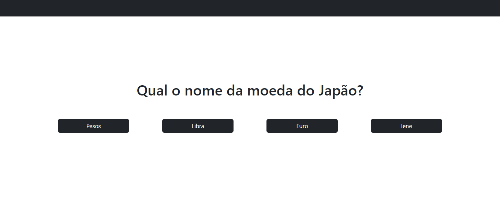
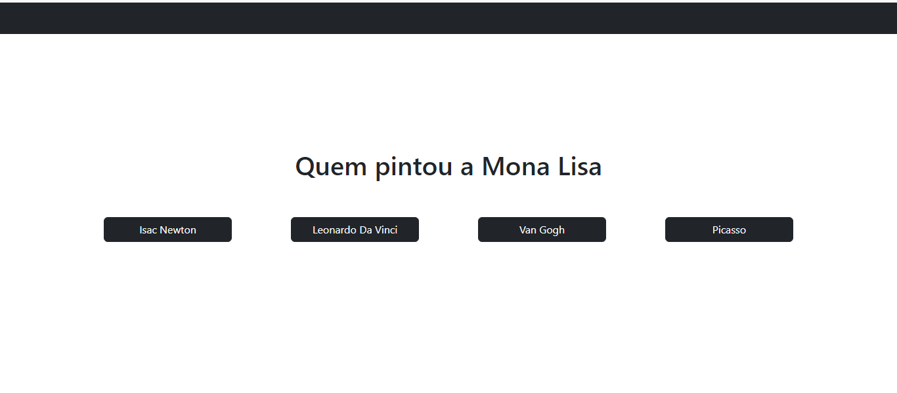
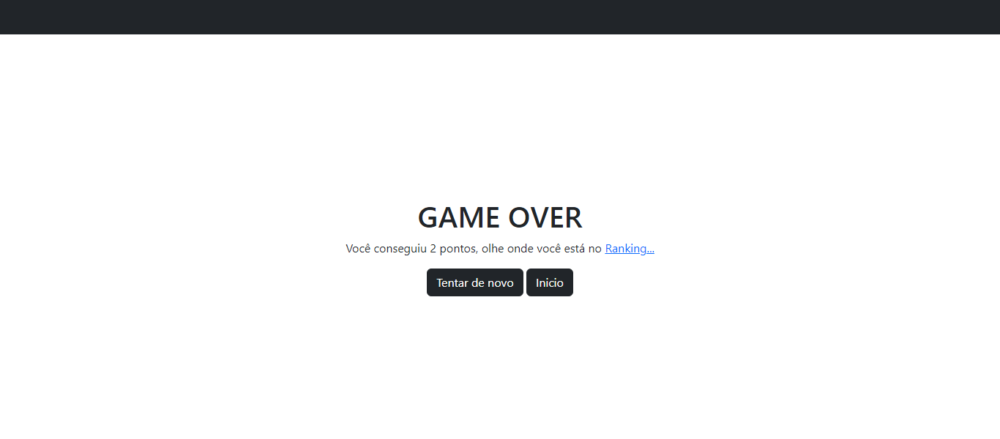
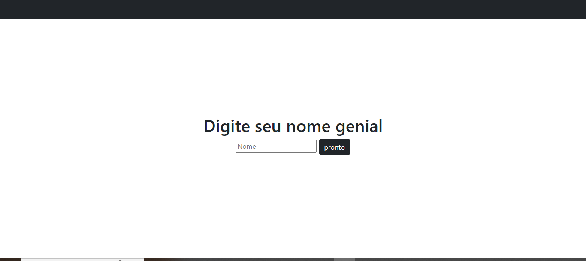
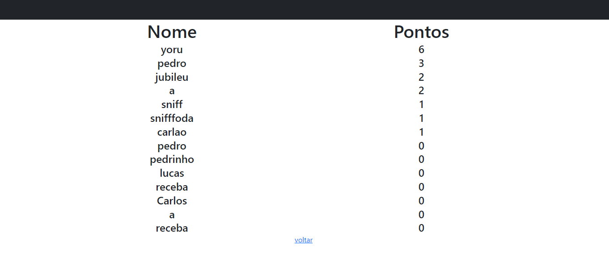

## Projeto Quizz - Java
### Tecnologias: 
Java EE, MySQL, Servidor Apache Tomcat, JavaScript, HTML5, Bootstrap.

### Descrição do Projeto: 
Um site de quiz em que o usuário responde a perguntas com quatro opções de respostas. Caso a resposta esteja certa, ele passa para a próxima pergunta, ganhando um ponto. Se errar, o jogo acaba e o usuário recebe a chance de registrar seus pontos e ver sua posição no ranking.

### Quando o usuario abre o site, se encontra com essa tela de start:

### Ao iniciar o jogo, o site manda um request pro banco de dados que pega uma pergunta de forma aleatoria e a mostra na tela:

### Caso ele acerte, a proxima pergunta é recebida pelo banco de dados. As perguntas nunca se repetem na mesma partida:

### Caso o usuario erre a resposta, ele é redirecionado para a tela de "fim de jogo". Caso queira, pode ver aonde ele ficou no ranking com os pontos que acomulou:

### Se o usuario decidir ver o ranking, ele é redirecionado para uma tela para poder escrever o nome que ele quer para entrar no ranking:

### Após inserir o nome, ele é finalmente redirecionado para o ranking que tambem é armazenado no banco de dados:

