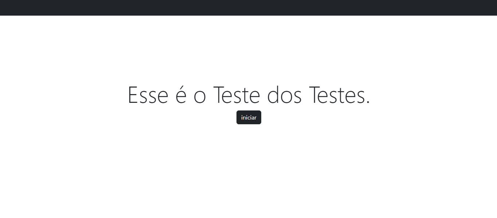

## Projeto Quizz - Java
### Tecnologias: 
Java EE, MySQL, Servidor Apache Tomcat, JavaScript, HTML5, Bootstrap.

### Descrição do Projeto: 
Um site de quiz em que o usuário responde a perguntas com quatro opções de respostas. Caso a resposta esteja certa, ele passa para a próxima pergunta, ganhando um ponto. Se errar, o jogo acaba e o usuário recebe a chance de registrar seus pontos e ver sua posição no ranking.

